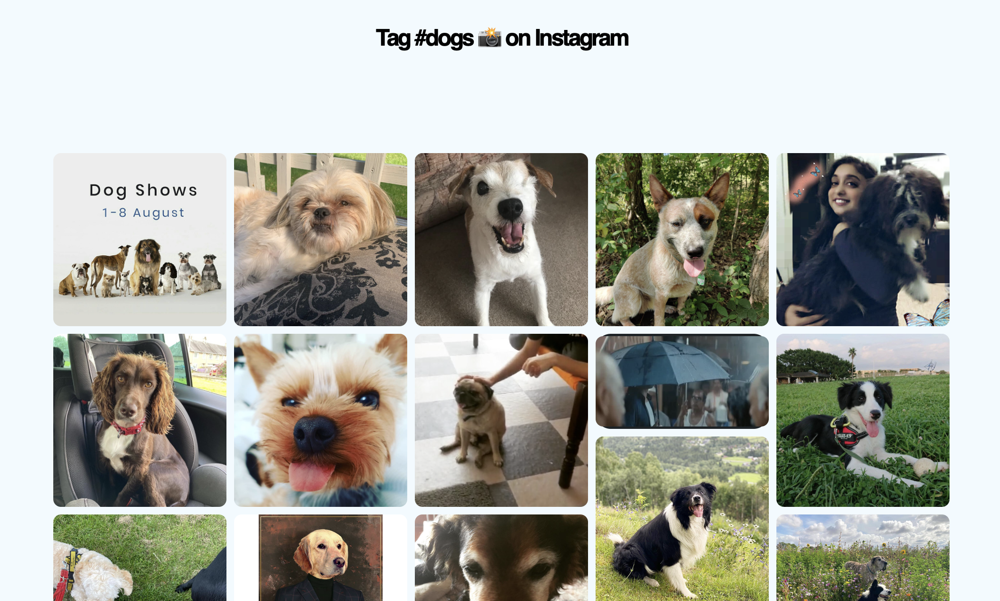

# Instagram Masonry 📸

> This is an example implementation of the [Masonic](https://www.npmjs.com/package/masonic) library to dynamically position images on a webpage in a masonry brick style.

### Getting Started

1. Install the React dependencies using: `$ npm install`
2. Start the application using: `$ npm start`
3. List top images tagged with a given hashtag by adding the _hashtag_ query parameter to the URL: `localhost:3000/?hashtag=dogs` (default = puppies) 🐶
4. Build something `#cool` with this starter template! 🥳

### Output

